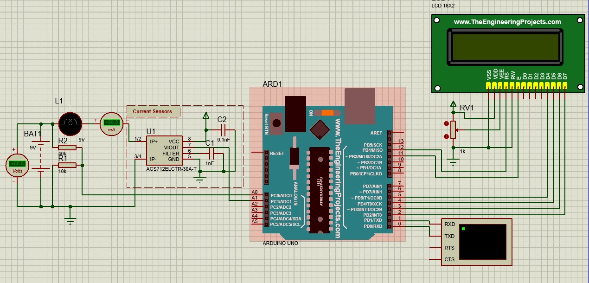

# Arduino Uno Multimeter

## Description: 
### In the repo I have a Arduino code created to make a multimeter to measure the voltage from **0v** to **25v** and current from **0A** to **30A** using ACS712

there is another code for **MAX741** but that IC is not in proteus Libraries though.

## Components:

### Using 1 Arduino Uno, ACS712, 1 LCD 16x2, 1 potentiometer, 2 resistences, 9v lamp, and 9v battery.

| Pins to Arduino       | Description                                   |
| --------------------- | --------------------------------------------- |
| VCC -> 5V             | 5 volts For powering the components.          |
| GND -> GND            | Ground for all the components.                |
| D4 -> 5               | D4 of LCD to pin 5 in Arduino                 |
| D5 -> 4               | D5 of LCD to pin 4 in Arduino                 |
| D6 -> 3               | D6 of LCD to pin 3 in Arduino                 |
| D7 -> 2               | D7 of LCD to pin 2 in Arduino                 |
| E   -> 11             | E of LCD to pin 11 in Arduino                 |
| RS -> 12              | RS of LCD to pin 12 in Arduino                |
| RW -> GND             | RW of LCD to Ground                           |
| VSS -> GND            | VSS of LCD to Ground                          |
| VDD -> 5V             | VDD of LCD to 5V                              |
| VEE -> POT output     | VEE of LCD to potentiometer to output         |
| VIOUT -> A1           | VIOUT of ACS712 to A1                         |
| Voltage_divider -> A0 | Voltage divider of resistance R1 and R2 to A0 |